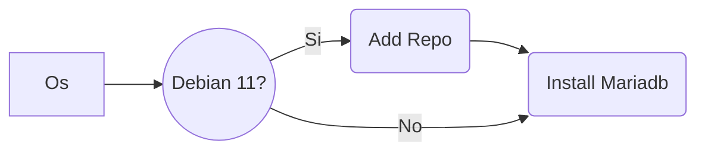

## Instalacion Daloradius en debian 11 y 12
Recomiendo debian 11, ya que en 12 por alguna razon desconocida en la parte de accounting introduciendo el usuario no aparecen los registros.
### Preparacion del sistema.
Deshabilitamos lighttpd para evitar error con apache.
```
systemctl stop lighttpd.service
systemctl disable lighttpd.service
```

- Permitimos el acceso al vps con password
_Abrimos el archivo a modificar con nano_
```
nano /etc/ssh/sshd_config
```
_Dejamos las siguientes lineas a yes_
```
PermitRootLogin yes
PasswordAuthentication yes
```
- Elegimos una clave para nuestro usuario root y reiniciamos los servicios
```
passwd root
```
_Despues de cambiar nuestro password,reiniciamos los servicios_
```
service ssh restart
systemctl restart sshd
```

### Instalacion de Mariadb.
- Instalamos algunos paquetes necesarios para daloradius
```
apt -y install software-properties-common gnupg2 dirmngr git wget zip unzip sudo -y
```
- En debian 11 se agrega el siguiente repositorio, para debian 12 no es necesario.


```
apt-key adv --fetch-keys 'https://mariadb.org/mariadb_release_signing_key.asc'
```
```
add-apt-repository 'deb [arch=amd64,arm64,ppc64el] https://mirror.rackspace.com/mariadb/repo/10.5/debian bullseye main'

## Para eliminar el repositorio
# rm -r /etc/apt/sources.list.d/archive_uri-https_mirror_rackspace_com_mariadb_repo_10_5_debian-bookworm.list
```
_Actualizamos el Sistema_
```
apt -y update
```

- Realizamos la  ***instalacion de mariadb***
```
apt install mariadb-server mysqltuner -y
```

```
systemctl start mysql.service
```
- Creamos la base de datos.
```
mysql_secure_installation
```
Te apareceran algunas opciones de configuracion.
```
#n
#n
#y
#n
#y
#y
# Disallow root login remotely? [Y/n] n
```
- se crea la db y se le agrega un password, el usado en esta instalacion es ***Passw@rd***

```
mysql -u root
```
```
CREATE DATABASE radius;
GRANT ALL ON radius.* TO radius@localhost IDENTIFIED BY "Passw@rd";
```
```
FLUSH PRIVILEGES;
quit;
```
### Instalacion apache2 freeradius

- Instalacion de apache server ( si hay instalado lighttpd deshabilitarlo para que no entre en conflicto `systemctl disable lighttpd` )
> [!CAUTION]
> El siguiente codigo lanzalo linea a linea osea uno a uno.
```
apt -y install apache2
```
```
apt -y install php libapache2-mod-php php-{gd,common,mail,mail-mime,mysql,pear,mbstring,xml,curl}
```
```
apt -y install freeradius freeradius-mysql freeradius-utils
```
```
systemctl enable --now freeradius.service
```
```
mysql --user=root radius < /etc/freeradius/3.0/mods-config/sql/main/mysql/schema.sql
```
```
ln -s /etc/freeradius/3.0/mods-available/sql /etc/freeradius/3.0/mods-enabled/
```
### Instalacion de Daloradius
- Clonamos este repositorio el cual contiene daloradius v1.3 con algunas modificaciones necesarias para que funcione correctamente.

```
git clone https://github.com/wispconf/daloradiusred.git daloradiusred
```

- Movemos la carpeta daloradius a html del servidor
```
\mv /root/daloradiusred/server/daloradius /var/www/html/
\mv /root/daloradiusred/server/print /var/www/html/
```

- Remplazamos los archivos originales por los modificados, ya llevan los cambios necesarios para funcionar adecuadamente.

```
\mv /root/daloradiusred/root/dalomv/radiusd.conf /etc/freeradius/3.0/radiusd.conf
\mv /root/daloradiusred/root/dalomv/exten-radius_server_info.php /var/www/html/daloradius/library/exten-radius_server_info.php
\mv /root/daloradiusred/root/dalomv/default /etc/freeradius/3.0/sites-enabled/default
\mv /root/daloradiusred/root/dalomv/sqlcounter /etc/freeradius/3.0/mods-available/sqlcounter
\mv /root/daloradiusred/root/dalomv/access_period.conf /etc/freeradius/3.0/mods-config/sql/counter/mysql/access_period.conf
\mv /root/daloradiusred/root/dalomv/quotalimit.conf /etc/freeradius/3.0/mods-config/sql/counter/mysql/quotalimit.conf
\mv /root/daloradiusred/root/dalomv/eap /etc/freeradius/3.0/mods-available/eap
\mv /root/daloradiusred/root/dalomv/queries.conf /etc/freeradius/3.0/mods-config/sql/main/mysql/queries.conf
\mv /root/daloradiusred/root/dalomv/radutmp /etc/freeradius/3.0/mods-enabled/radutmp
\mv /root/daloradiusred/root/dalomv/sql /etc/freeradius/3.0/mods-available/sql
\mv /root/daloradiusred/root/dalomv/daloradius.conf.php /var/www/html/daloradius/library/daloradius.conf.php
\mv /root/daloradiusred/root/dalomv/mng-batch-add.php /var/www/html/daloradius/mng-batch-add.php
\mv /root/daloradiusred/root/dalomv/en.php /var/www/html/daloradius/lang/en.php
```

- Damos permisos necesarios
```
chgrp -h freerad /etc/freeradius/3.0/mods-available/sql
chown -R freerad:freerad /etc/freeradius/3.0/mods-enabled/sql
chown -R www-data:www-data /var/www/html/daloradius/
chmod 664 /var/www/html/daloradius/library/daloradius.conf.php
```

## Instalacion de Daloradius
```
cd /var/www/html/daloradius/
```

```
mysql --user=root radius < contrib/db/fr2-mysql-daloradius-and-freeradius.sql
```

```
mysql --user=root radius < contrib/db/mysql-daloradius.sql
```

- Regresamos a root
- Colocamos zona horaria

```
cd
timedatectl set-timezone America/Mexico_City
```

- Instalamos pear

```
pear install DB
pear install MDB2
pear channel-update pear.php.net
```
-  Agregaremos una tabla (printme) tipo view a la base de datos radius, esta nos servira para extraer los datos (batch_name,planname,plancost,username,value) para la impresion de lotes.

```
mysql --user=root radius < /root/daloradiusred/root/dalomv/printme.sql
```
```
mysql --user=root radius < /root/daloradiusred/root/dalomv/usadas.sql
```

- Damos permisos a algunas carpetas y archivos para generar los logs.
```
chmod 777  /var/log/syslog
chmod 777 /var/log/freeradius
#chmod 755 /var/log/radius/
#chmod 644 /var/log/radius/radius.log
touch /var/log/messages
chmod 644 /var/log/messages
#chmod 644 /var/log/dmesg
touch /tmp/daloradius.log
```
- Algunos archivos de configuracion y scripts llevan dentro nuestro password  **Passw@rd**, por lo que lo cambiaremos al que hayamos elejido  **84Elij@**.

- Cambia **84Elij@** por el password propio.

```
passwd="84Elij@"
```
En el siguiente no cambies nada, ya que sera remplazado por el que se coloco en el anterior paso.
```
sed -i "s/Passw@rd/$passwd/g" "/var/www/html/daloradius/library/daloradius.conf.php"
sed -i "s/Passw@rd/$passwd/g" "/var/www/html/print/index.php"
sed -i "s/Passw@rd/$passwd/g" "/var/www/html/print/SimpleAuth.php"
sed -i "s/Passw@rd/$passwd/g" "/etc/freeradius/3.0/mods-available/sql"
```
- Reiniciar sistema e ingresar

```
reboot
```

> El siguiente codigo lanzalo linea a linea osea uno a uno para checar servicios.
```
systemctl status apache2
```
```
systemctl status freeradius
```

- Ingresar a daloradius por la direccion `http://IP/daloradius` con usuario `administrator` y clave   `radius` 
Observa que aparece un usuario `Rivera` en inicio, puedes cambiarlo al tuyo por ejemplo ***Myusuario***.
```
sed -i 's/Rivera/Myusuario/g' "/var/www/html/daloradius/login.php"
```

_Si hay error de puertos Es necesario que se abran los puertos en el vps de administracion 1812,1813,3306,6813,80,8080,443_

### Agregar Nas a la base de datos
Ingresamos a `http://IP/daloradius/mng-rad-nas-list.php` y agregamos un nuevo *NAS* con la IP `0.0.0.0/0` type `other` y una clave NAS Secret que sera nuestra clave para sincronizar a un mikrotik. o lo hacemos con el siguiente comando, recuerda cambiar el Secret **Passw@rd**.

```
mysql --user=root radius < /root/daloradiusred/root/dalomv/nas.sql
```

### Acceso a daloradius

```
Iniciar sesion
WEB: IP/daloradius
Usuario: administrator
Pass: radius
```
Despues de acceder, nos dirijimos a `http://IP/daloradius/config-operators.php` para cambiar el password y usuarios.


### Acceso a la pagina de impresion de voucher por lotes
Cuando se crea un lote de vouchers, con el nombre se puede imprimir todo el lote, este se encuentra listado en 
```
http://xxx.xxx.xx.xx/daloradius/mng-batch-list.php
```
Para imprimirlo accedemos a la pagina de impresion por lotes.

```
Iniciar sesion
WEB: IP/print
Usuario: Rivera
Pass: 84Elij@
```

Igual cambiamos el usuario Rivera por el propio (Myusuario).

```
sed -i 's/Rivera/Myusuario/g' "/var/www/html/print/SimpleAuth.php"
```
Aqui termina la instalacion de daloradius, opcionalmente puedes realizar lo siguiente.
- Checar si quedo algun archivo con la contraseña Passw@rd

```
grep -rl "Passw@rd" /root
grep -rl "Passw@rd" /var/www
grep -rl "Passw@rd" /etc

```
## Scripts de mantenimiento y crontab

- Agregando scripts y crontab para mantenimiento.
Yo he agregado algunos script para optimizar mis tareas cotidianas, como es el de realizar respaldos de la db, eliminar fichas o vouchers usados despues de ciertos x dias,
elimnar errores de Nas-Reboot que se ocasionan cuando se pierde la conexion del Nas con el servidor.

```
crontab -e
```

Agregamos las siguientes lineas
```
#backup diario de la base de datos daloradius
0 10 * * * sudo bash /root/scripts/backupdbradius.sh
#limpieza de fichas usadas corridas despues de x dias
0 20 * * * sudo bash /root/scripts/limpiaCorridos.sh
#limpieza de fichas usadas vigencia de 11 dias elegida en el script
0 22 * * * sudo bash /root/scripts/limpiaPausados.sh
#Limpieza errores Nas en accounting
*/5  * * * * sudo bash /root/scripts/NAS-Reboot.sh
#Limpieza de la db conexiones y accounting
*/10  * * * * sudo bash /root/scripts/rmtmpdb.sh
```

Guardamos el archivo, y ahora movemos la carpeta de los scripts a /root
```
\mv /root/daloradiusred/root/scripts /root/scripts/
\mv /root/daloradiusred/root/backupdb /root/backupdb/
```

- Para cambiarles el password a los scripts, recuerda que en vez de `84Elij@` necesitamos colocar el que elegimos.

> En el siguiente codigo coloca tu password en lugar de la variable ***84Elij@***.

```
passwd="84Elij@"
```

```
sed -i "s/Passw@rd/$passwd/g" "/root/scripts/backupdbradius.sh"
sed -i "s/Passw@rd/$passwd/g" "/root/scripts/limpiaCorridos.sh"
sed -i "s/Passw@rd/$passwd/g" "/root/scripts/limpiaPausados.sh"
sed -i "s/Passw@rd/$passwd/g" "/root/scripts/NAS-Reboot.sh"
sed -i "s/Passw@rd/$passwd/g" "/root/scripts/rmtmpdb.sh"
sed -i "s/Passw@rd/$passwd/g" "/root/scripts/cleaner/eliminabatch.sh"
sed -i "s/Passw@rd/$passwd/g" "/root/scripts/cleaner/removegroupname.sh"
sed -i "s/Passw@rd/$passwd/g" "/root/scripts/cleaner/rmcreationdate.sh"
sed -i "s/Passw@rd/$passwd/g" "/root/scripts/cleaner/rmuserinfofirst.sh"
sed -i "s/Passw@rd/$passwd/g" "/root/scripts/cleaner/rmxtiempocreado.sh"
sed -i "s/Passw@rd/$passwd/g" "/root/scripts/listar/crearlista.sh"
sed -i "s/Passw@rd/$passwd/g" "/root/scripts/listar/updategroupname.sh"
```

## Creacion de perfiles, planes
Los perfiles son los grupos que contienen las configuraciones de las tablas, la base de datos perfiles.sql esta compuesta por las siguientes tablas.
	***radgroupreply*** ; contiene datos de los perfiles de tiempo
	***radgroupcheck*** ; contiene datos de los perfiles de tiempo
	***billing_plans*** ; contiene los planes de costos 

- Se crearan los siguientes perfiles y planes de costos : 2HrPausada , 12HrPausada , 7dCorridos , 30dCorridos, XCorridos ,importando la tabla perfiles.sql que ya los contiene.
```
mysql --user=root radius < /root/daloradiusred/root/dalomv/perfiles.sql
#mysql --user=root radius < /root/daloradiusred/root/dalomv/perfiles.sql
```
El perfil agregado llamado XCorridos, no tiene tiempo limite, se le agrega el atributo ; Access-Period := 604800 al usuario creado en segundos..

***Max-All-Session*** : 7200 #Se refiere a 7200 segundos = 2Hrs en suma total de tiempo.
***Access-Period*** : 604800 # Se refiere a 604800 segundos = 7d en tiempo corrido desde el primer inicio.

## Comandos utiles para administracion
- Acceder a una base de datos
```
mysql --user=root radius
mysql --user=root --password=Passw@rd radius
```
- Elimina linea sandbox que marca error en importacion de base de datos
Al importar una base de datos, en las versiones mas recientes marca error, por lo que antes debemos lanzar el siguiente comando que elimina la primera linea de archivo sql.
```
sed -i '/sandbox mode/d' *.sql
```
- Exportar perfiles de tiempo, costo en una base de datos.
  Exporta las tablas siguientes en una sola base de datos.
	- radgroupreply ; contiene datos de los perfiles de tiempo
	- radgroupcheck ; contiene datos de los perfiles de tiempo
	- billing_plans ; contiene los planes de costos 
	- radcheck ; contiene el usuario , atributo y password 
	- radreply; contiene el usuario, atributo y operador
	- radpostauth; Lista de accesos o conexiones del usuario (ignorada)
	- userinfo; contiene la informacion del usuario y fecha de creacion.
	- radacct; Contiene la informacion del apartado accounting del usuario.
	- userbillinfo; relaciona el usuario con su debido plan de costo
	- batch_history; Contiene los lotes o batch creados.
	- radusergroup; relaciona al usuario con el grupo o perfil.

> Exportacion
```
mysqldump --user=root radius radgroupreply radgroupcheck billing_plans > perfiles.sql
```
```
mysqldump --user=root radius radcheck radreply userinfo radacct userbillinfo batch_history radusergroup > usuarios.sql
```
> Importacion
```
sed -i '/sandbox mode/d' *.sql
```
```
mysql --user=root radius < perfiles.sql
```
```
mysql --user=root radius < usuarios.sql
```
- Buscar documentos que contengan una palabra especifica para despues modificarla o cambiarla,

```
grep -rl "palabuscar" /root
```
Ahora la cambiamos usando una variable

```
variable="nuevapalabra"
```

```
sed -i "s/palabuscar/$variable/g" "/root/carp/xdoc.sh"
sed -i "s/palabuscar/$variable/g" "/root/carp/doc2.doc"
sed -i "s/palabuscar/$variable/g" "/root/carp3/arch.txt"
```

- Respaldo carpeta html completa

```
cd /var/www
tar -zcvf html.tar.gz html
Descomprimir con
cd /var/www/html
tar -xf html.tar.gz
```
- Descomprimir zip

```
apt install unzip
```

```
unzip archivo.zip
```
