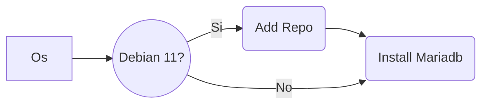

## Instalacion Daloradius en debian 11 y 12

### Preparacion del sistema.
- Activar ipv6
```
enable_ipv6
sysctl -p
```
En `cat /etc/sysctl.conf` deveria estar `net.ipv6.conf.all.disable_ipv6 = 0` en el archivo.

Tambien deshabilitamos lighttpd para evitar error con apache.
```
systemctl stop lighttpd.service
systemctl disable lighttpd.service
```

- Permitimos el acceso al vps con password
_Abrimos el archivo a modificar con nano_
```
nano /etc/ssh/sshd_config
```
_Dejamos las siguientes lineas a yes_
```
PermitRootLogin yes
PasswordAuthentication yes
```
- Elegimos una clave para nuestro usuario root y reiniciamos los servicios
```
passwd root
```
_Despues de cambiar nuestro password,reiniciamos los servicios_
```
service ssh restart
systemctl restart sshd
```

### Instalacion de Mariadb.
- Instalamos algunos paquetes necesarios para daloradius
```
apt -y install software-properties-common gnupg2 dirmngr git wget zip unzip sudo -y
```
- En debian 11 se agrega el siguiente repositorio, para debian 12 no es necesario.


```
apt-key adv --fetch-keys 'https://mariadb.org/mariadb_release_signing_key.asc'
```
```
add-apt-repository 'deb [arch=amd64,arm64,ppc64el] https://mirror.rackspace.com/mariadb/repo/10.5/debian bullseye main'

## Para eliminar el repositorio
# rm -r /etc/apt/sources.list.d/archive_uri-https_mirror_rackspace_com_mariadb_repo_10_5_debian-bookworm.list
```
_Actualizamos el Sistema_
```
apt -y update
```

- Realizamos la  ***instalacion de mariadb***
```
apt install mariadb-server mysqltuner -y
```

```
systemctl start mysql.service
```
- Creamos la base de datos.
```
mysql_secure_installation
```
Te apareceran algunas opciones de configuracion.
```
#n
#n
#y
#n
#y
#y
# Disallow root login remotely? [Y/n] n
# 
```
- se crea la db y se le agrega un password, el usado en esta instalacion es ***Passw@rd***

```
mysql -u root -p
```
```
CREATE DATABASE radius;
GRANT ALL ON radius.* TO radius@localhost IDENTIFIED BY "Passw@rd";
```
```
FLUSH PRIVILEGES;
quit;
```
### Instalacion apache2 freeradius

- Instalacion de apache server ( si hay instalado lighttpd deshabilitarlo para que no entre en conflicto `systemctl disable lighttpd` )
> [!CAUTION]
> El siguiente codigo lanzalo linea a linea osea uno a uno.
```
apt -y install apache2
```
```
apt -y install php libapache2-mod-php php-{gd,common,mail,mail-mime,mysql,pear,mbstring,xml,curl}
```
```
apt -y install freeradius freeradius-mysql freeradius-utils
```
```
systemctl enable --now freeradius.service
```
```
mysql -u root -p radius < /etc/freeradius/3.0/mods-config/sql/main/mysql/schema.sql
```
```
ln -s /etc/freeradius/3.0/mods-available/sql /etc/freeradius/3.0/mods-enabled/
```
### Instalacion de Daloradius
- Clonamos este repositorio el cual contiene daloradius v1.3 con algunas modificaciones necesarias para que funcione correctamente.

```
git clone https://github.com/wispconf/daloradiusred.git daloradiusred
```

- Movemos la carpeta daloradius a html del servidor
```
\mv /root/daloradiusred/server/daloradius /var/www/html/
\mv /root/daloradiusred/server/print /var/www/html/
```

- Remplazamos los archivos originales por los modificados, ya llevan los cambios necesarios para funcionar adecuadamente.

```
\mv /root/daloradiusred/root/dalomv/radiusd.conf /etc/freeradius/3.0/radiusd.conf
\mv /root/daloradiusred/root/dalomv/exten-radius_server_info.php /var/www/html/daloradius/library/exten-radius_server_info.php
\mv /root/daloradiusred/root/dalomv/default /etc/freeradius/3.0/sites-enabled/default
\mv /root/daloradiusred/root/dalomv/sqlcounter /etc/freeradius/3.0/mods-available/sqlcounter
\mv /root/daloradiusred/root/dalomv/access_period.conf /etc/freeradius/3.0/mods-config/sql/counter/mysql/access_period.conf
\mv /root/daloradiusred/root/dalomv/quotalimit.conf /etc/freeradius/3.0/mods-config/sql/counter/mysql/quotalimit.conf
\mv /root/daloradiusred/root/dalomv/eap /etc/freeradius/3.0/mods-available/eap
\mv /root/daloradiusred/root/dalomv/queries.conf /etc/freeradius/3.0/mods-config/sql/main/mysql/queries.conf
\mv /root/daloradiusred/root/dalomv/radutmp /etc/freeradius/3.0/mods-enabled/radutmp
\mv /root/daloradiusred/root/dalomv/sql /etc/freeradius/3.0/mods-available/sql
\mv /root/daloradiusred/root/dalomv/daloradius.conf.php /var/www/html/daloradius/library/daloradius.conf.php
```

- Damos permisos necesarios
```
chgrp -h freerad /etc/freeradius/3.0/mods-available/sql
chown -R freerad:freerad /etc/freeradius/3.0/mods-enabled/sql
chown -R www-data:www-data /var/www/html/daloradius/
chmod 664 /var/www/html/daloradius/library/daloradius.conf.php
```

## Instalacion de Daloradius
```
cd /var/www/html/daloradius/
```

```
mysql -u root -p radius < contrib/db/fr2-mysql-daloradius-and-freeradius.sql
```

```
mysql -u root -p radius < contrib/db/mysql-daloradius.sql
```

- Regresamos a root
```
cd
```

- Colocamos zona horaria

```
timedatectl set-timezone America/Mexico_City
```

- Instalamos pear

```
pear install DB
pear install MDB2
pear channel-update pear.php.net
```
-  Agregaremos una tabla (printme) tipo view a la base de datos radius, esta nos servira para extraer los datos (batch_name,planname,plancost,username,value) para la impresion de lotes.

```
mysql -p -u root radius < /root/daloradiusred/root/dalomv/printme.sql
```

- Damos permisos a algunas carpetas y archivos para generar los logs.
```
chmod 777  /var/log/syslog
chmod 777 /var/log/freeradius
#chmod 755 /var/log/radius/
#chmod 644 /var/log/radius/radius.log
touch /var/log/messages
chmod 644 /var/log/messages
#chmod 644 /var/log/dmesg
touch /tmp/daloradius.log
```
- Algunos archivos de configuracion y scripts llevan dentro nuestro password  **Passw@rd**, por lo que lo cambiaremos al que hayamos elejido  **84Elij@**.

- Cambia **84Elij@** por el password propio.

```
passwd="84Elij@"
```
En el siguiente no cambies nada, ya que sera remplazado por el que se coloco en el anterior paso.
```
sed -i "s/Passw@rd/$passwd/g" "/var/www/html/daloradius/library/daloradius.conf.php"
sed -i "s/Passw@rd/$passwd/g" "/var/www/html/print/index.php"
sed -i "s/Passw@rd/$passwd/g" "/var/www/html/print/SimpleAuth.php"
sed -i "s/Passw@rd/$passwd/g" "/etc/freeradius/3.0/mods-available/sql"
```
- Reiniciar sistema e ingresar

```
reboot
```

> [!CAUTION]
> El siguiente codigo lanzalo linea a linea osea uno a uno para checar servicios.
```
systemctl status apache2
systemctl status freeradius
```

- Ingresar a daloradius por la direccion `http://IP/daloradius` con usuario `administrator` y clave   `radius` 
Observa que aparece un usuario `Rivera` en inicio, puedes cambiarlo al tuyo por ejemplo ***Myusuario***.
```
sed -i 's/Rivera/Myusuario/g' "/var/www/html/daloradius/login.php"
```

_Si hay error de puertos Es necesario que se abran los puertos en el vps de administracion 1812,1813,3306,6813,80,8080,443_

### Acceso a daloradius

```
Iniciar sesion
WEB: IP/daloradius
Usuario: administrator
Pass: radius
```
Despues de acceder, nos dirijimos a `http://IP/daloradius/config-operators.php` para cambiar el password y usuarios.

### Acceso a la pagina de impresion de voucher por lotes
Cuando se crea un lote de vouchers, con el nombre se puede imprimir todo el lote, este se encuentra listado en 
```
http://xxx.xxx.xx.xx/daloradius/mng-batch-list.php
```
Para imprimirlo accedemos a la pagina de impresion por lotes.

```
Iniciar sesion
WEB: IP/print
Usuario: Rivera
Pass: 84Elij@
```

Igual cambiamos el usuario Rivera por el propio (Myusuario).

```
sed -i 's/Rivera/Myusuario/g' "/var/www/html/print/SimpleAuth.php"
```
Aqui termina la instalacion de daloradius, opcionalmente puedes realizar lo siguiente.

## Scripts de mantenimiento y crontab

- Agregando scripts y crontab para mantenimiento.
Yo he agregado algunos script para optimizar mis tareas cotidianas, como es el de realizar respaldos de la db, eliminar fichas o vouchers usados despues de ciertos x dias,
elimnar errores de Nas-Reboot que se ocasionan cuando se pierde la conexion del Nas con el servidor.

```
crontab -e
```

Agregamos las siguientes lineas
```
#backup diario de la base de datos daloradius
0 10 * * * sudo bash /root/scripts/backupdbradius.sh
#limpieza de fichas usadas vigencia de 11 dias elegida en el script
0 20 * * * sudo bash /root/scripts/limpiaCorridos.sh
#limpieza de fichas usadas vigencia de 11 dias elegida en el script
0 22 * * * sudo bash /root/scripts/limpiaPausados.sh
*/5  * * * * sudo bash /root/scripts/NAS-Reboot.sh
```

Guardamos el archivo, y ahora movemos la carpeta de los scripts a /root
```
\mv /root/daloradiusred/root/scripts /root/scripts/
\mv /root/daloradiusred/root/backupdb /root/backupdb/
```

- Para cambiarles el password a los scripts, recuerda que en vez de `84Elij@` necesitamos colocar el que elegimos.
> [!CAUTION]
> En el siguiente codigo coloca tu password en lugar de la variable ***84Elij@***.

```
passwd="84Elij@"
```

```
sed -i "s/Passw@rd/$passwd/g" "/root/scripts/rmanual/limpiamanual.sh"
sed -i "s/Passw@rd/$passwd/g" "/root/scripts/limpiaCorridos.sh"
sed -i "s/Passw@rd/$passwd/g" "/root/scripts/limpia7dCorridos.sh"
sed -i "s/Passw@rd/$passwd/g" "/root/scripts/cleaner/rmcreationdate.sh"
sed -i "s/Passw@rd/$passwd/g" "/root/scripts/cleaner/eliminabatch.sh"
sed -i "s/Passw@rd/$passwd/g" "/root/scripts/cleaner/rmuserinfofirst.sh"
sed -i "s/Passw@rd/$passwd/g" "/root/scripts/cleaner/removegroupname.sh"
sed -i "s/Passw@rd/$passwd/g" "/root/scripts/cleaner/eliminadb.sh"
sed -i "s/Passw@rd/$passwd/g" "/root/scripts/listar/crearlista.sh"
sed -i "s/Passw@rd/$passwd/g" "/root/scripts/backupdbradius.sh"
sed -i "s/Passw@rd/$passwd/g" "/root/scripts/cleanradpostauth.sh"
sed -i "s/Passw@rd/$passwd/g" "/root/scripts/limpiaPausados.sh"
sed -i "s/Passw@rd/$passwd/g" "/root/scripts/radacct_trim.sh"
sed -i "s/Passw@rd/$passwd/g" "/root/scripts/NAS-Reboot.sh"
```

## Creacion de perfiles, planes
Los perfiles son los grupos que contienen las configuraciones de las tablas radgroupreply y radgroupcheck utilizados para asignar a cada ficha o voucher.
Los planes en la tabla billing_plans son los costos de cada ficha y esta ligado al perfil.

- Se crearan los siguientes perfiles : 2HrPausada , 12HrPausada , 7dCorridos , 30dCorridos

1. Forma 1 , importando la tabla que ya los contiene.
```
mysql --user=root --password=Passw@rd radius < /root/daloradiusred/root/dalomv/checkreplyplans.sql
```
2. Forma 2 , introduciendo los datos en las tablas por medio de la terminal.

- Entramos en la base de datos radius
```
mysql --user=root --password=Passw@rd radius
```

- Agregamos a la tabla radgroupcheck los datos
```
INSERT INTO `radgroupcheck` VALUES
(3,'2HrPausada','Max-All-Session',':=','7200'),
(4,'2HrPausada','Fall-Through',':=','Yes'),
(5,'2HrPausada','Simultaneous-Use',':=','1'),
(6,'12HrPausada','Max-All-Session',':=','43200'),
(7,'12HrPausada','Fall-Through',':=','Yes'),
(8,'12HrPausada','Simultaneous-Use',':=','1'),
(9,'7dCorridos','Access-Period',':=','604800'),
(10,'7dCorridos','Fall-Through',':=','Yes'),
(11,'7dCorridos','Simultaneous-Use',':=','1'),
(12,'30dCorridos','Access-Period',':=','2592000'),
(13,'30dCorridos','Fall-Through',':=','Yes'),
(14,'30dCorridos','Simultaneous-Use',':=','1');
```

***Max-All-Session*** : 7200 #Se refiere a 7200 segundos = 2Hrs en suma total de tiempo.
***Access-Period*** : 604800 # Se refiere a 604800 segundos = 7d en tiempo corrido desde el primer inicio.

- Agregamos a la tabla radgroupreply los datos
```
INSERT INTO `radgroupreply` VALUES
(1,'2HrPausada','Mikrotik-Rate-Limit',':=','512K/2M 1M/3M 384K/1500K 16/12 8 256K/1000K'),
(2,'2HrPausada','Acct-Interim-Interval',':=','60'),
(3,'12HrPausada','Mikrotik-Rate-Limit',':=','512K/2M 1M/3M 384K/1500K 16/12 8 256K/1000K'),
(4,'12HrPausada','Acct-Interim-Interval',':=','60'),
(5,'7dCorridos','Mikrotik-Rate-Limit',':=','512K/2M 1M/3M 384K/1500K 16/12 8 256K/1000K'),
(6,'7dCorridos','Acct-Interim-Interval',':=','60'),
(7,'30dCorridos','Mikrotik-Rate-Limit',':=','512K/2M 1M/3M 384K/1500K 16/12 8 256K/1000K'),
(8,'30dCorridos','Acct-Interim-Interval',':=','60');
```
- Agregamos los planes a la tabla billing_plans
```
INSERT INTO `billing_plans` VALUES
(1,'2HrPausada','','Prepaid','','Time-To-Finish','','','','','','','','No','Never','Fixed','10','8','2','MXN','','yes','2024-12-15 20:53:36','administrator',NULL,NULL),
(2,'12HrPausada','','Prepaid','','Time-To-Finish','','','','','','','','No','Never','Fixed','30','24','6','MXN','','yes','2024-12-15 20:55:16','administrator',NULL,NULL),
(3,'7dCorridos','','Prepaid','','Time-To-Finish','','','','','','','','No','Never','Fixed','50','40','10','MXN','','yes','2024-12-15 20:57:07','administrator',NULL,NULL),
(4,'30dCorridos','','Prepaid','','Time-To-Finish','','','','','','','','No','Never','Fixed','200','160','40','MXN','','yes','2024-12-15 20:57:37','administrator',NULL,NULL);
```

Como podras observar, puedes cambiar los datos a tu gusto ya sea por medio de la terminal o directamente en el servidor cuando ya se hayan importado.

## Comandos utiles para administracion
- Acceder a una base de datos
```
mysql --user=root --password=Passw@rd radius
```
- Buscar una documentos que contengan una palabra especifica para despues modificarla o cambiarla,

```
grep -rl "palabuscar" /root
```
Ahora la cambiamos usando una variable

```
variable="nuevapalabra"
```

```
sed -i "s/palabuscar/$variable/g" "/root/carp/xdoc.sh"
sed -i "s/palabuscar/$variable/g" "/root/carp/doc2.doc"
sed -i "s/palabuscar/$variable/g" "/root/carp3/arch.txt"
```

- Respaldo carpeta html completa

```
cd /var/www
tar -zcvf html.tar.gz html
Descomprimir con
cd /var/www/html
tar -xf html.tar.gz
```
- Descomprimir zip

```
apt install unzip
```

```
unzip archivo.zip
```
- respaldo de una tabla de la base de datos

```
mysqldump -u [user name] –p [password] [database_name] [tablename] > tabla.sql
#mysqldump -u root –p Passw@rd radius printme > printme.sql
```
- respaldo de una base de datos

```
mysqldump -u [user name] –p [password] [database_name] > db.sql
#mysqldump -u root –p Passw@rd radius > db.sql
```
